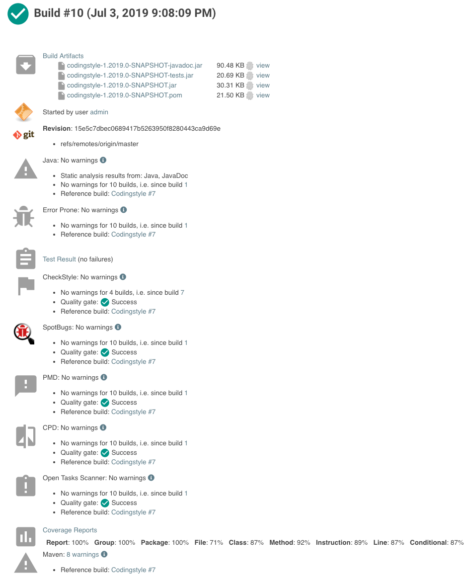

# Continuous Integration des Coding Style

Gemäß des Grundsatzes **eat your own dogfood** ist dieser Coding Style bereits für die Continuous Integration
in [Travis](https://travis-ci.org) und [Jenkins](https://jenkins.io) vorbereitet. 

## Maven Konfiguration

Sowohl für Travis als auch für Jenkins erfolgt die Automatisierung des Builds über Maven. Im zugehörigen 
[POM](../pom.xml) sind alle Versionen der benutzten Maven Plugins und der benötigten Abhängigkeiten über Properties
definiert, d.h. eine Aktualisierung laesst sich im entsprechenden Abschnitt leicht selbst durchführen bzw. über das 
Maven Kommando `mvn versions:update-properties` automatisch aktualisieren. U.a. sind die folgenden Plugins vorkonfiguriert:
- maven-compiler-plugin: konfiguriert die Java Version und legt alle Error Prone Regeln fest
- maven-javadoc-plugin: aktiviert die strikte Prüfung von JavaDoc Kommentaren
- maven-jar-plugin: legt einen Modulnamen fest, falls das Projekt in Java 9 oder höher verwendet wird. Außerdem wird
ein test-jar konfiguriert, so dass alle Tests (und abstrakte Testklassen) auch als Dependencies genutzt werden können.
- maven-pmd-plugin: prüft das Projekt mit PMD, die Regeln liegen in der Datei [pmd-configuration.xml](../etc/pmd-configuration.xml).
- maven-checkstyle-plugin: prüft das Projekt mit CheckStyle, die Regeln liegen in der Datei [checkstyle-configuration.xml](../etc/checkstyle-configuration.xml).
- spotbugs-maven-plugin: prüft das Projekt mit SpotBugs, alle Regeln werden verwendet mit den Ausnahmen definiert in der Datei [spotbugs-exclusion-filter.xml](../etc/spotbugs-exclusion-filter.xml).
- org.revapi: prüft ob die aktuelle Versionsnummer die [semantische Versionierung](https://semver.org) berücksichtigt (source and binary). D.h. es gilt:
    1. Eine neue Major Version wurde definiert, wenn das API nicht mehr abwärtskompatibel ist
    2. Eine neue Major Version wurde definiert, wenn eine neue Funktionalität abwärtskompatibel hinzugefügt wurde
    3. Eine neue PATCH Version wurde definiert, wenn Fehler abwärtskompatibel behoben wurden
- maven-surefire-plugin: aktiviert das Erkennen der Annotationen der Architekturtests mit [ArchUnit](https://www.archunit.org)
- jacoco-maven-plugin: misst die Code Coverage der Testfälle mit [JaCoCo](https://www.jacoco.org)
- pitest-maven: misst die Mutation Coverage der Testfälle mit [PITest](http://pitest.org)

## Travis

Die Konfiguration der Continuous Integration in Travis is sehr [einfach](../.travis.yml). Da der gesamt Build 
über Maven automatisiert ist, besteht die Konfiguration eigentlich nur aus dem Maven Aufruf 
`mvn -B -V clean verify jacoco:prepare-agent test jacoco:report`. Damit wird das Projekt gebaut, alle Tests (Unit und 
Integrationstests) werden ausgeführt, die statische Code Analyse wird durchgeführt und schließlich werden nochmals
alle Test mit dem Code Coverage Tool JaCoCo analysiert. Bei einem erfolgreichen Build werden die Code Coverage 
Ergebnisse in die Platform [CodeCov](https://codecov.io/gh/uhafner/codingstyle) hochgeladen. Da Travis OSS Projekte
kostenlos baut, kann das Ergebnis der CI des Coding Style auf der [Travis Projekt Seite](https://travis-ci.org/uhafner/codingstyle) direkt eingesehen werden.

## Jenkins

Eine Beispielintegration in Jenkins ist auch bereits vorhanden. Diese ist im [Jenkinsfile](../Jenkinsfile) hinterlegt
und startet die Integration in mehreren Schritten (Stages). Zunächst werden auch hier alle Schritte wie in Travis
aufgerufen. Anschließend erfolgt noch ein Start der Mutation Coverage mit [PIT](http://pitest.org). Insgesamt ist
die CI Konfiguration für Jenkins umfangreicher, da nicht nur der eigentliche Build konfiguriert wird, sondern
auch die Darstellung der Ergebnisse im Jenkins UI über die entsprechenden Jenkins Plugins konfiguriert wird.
Eine solche Visualisierung ist unter Travis nicht verfügbar. 

### Lokale CI in Jenkins (über Docker Compose)

Da es für Jenkins keinen öffentlichen Service wie bei Travis gibt, um eigene Projekte zu bauen, muss die Jenkins 
Integration lokal durchgeführt werden. Zur Vereinfachung des Jenkins Setup ist in diesem Coding Style eine
lauffähige Jenkins Installation enthalten (im Sinne von *Infrastructure as Code*). 
Diese kann über `docker-compose up` im Hauptverzeichnis gestartet werden. Anschließend wird die
aktuelle Jenkins LTS Version mit allen benötigten Plugins in einem Docker Container gebaut und gestartet (das dauert
beim ersten Aufruf etwas). Dazu wird ebenso ein als Docker Container initialisierter Java Agent (**Achtung**: Java 8) 
verbunden, der die Builds ausführt. Nach einem erfolgreichem Start von Jenkins ist dann unter 
[http://localhost:8080/job/Codingstyle/](http://localhost:8080/job/Codingstyle/) 
der entsprechende Jenkins Job sichtbar. Der Zugang auf diesen lokalen Rechner erfolgt zur Vereinfachung 
mit Benutzer `admin` und Passwort `admin`, anschließend hat man volle Jenkins Administrationsrechte. 
Der Job `Codingstyle` muss danach manuell gestartet werden,
die Ergebnisse der Tests, Code und Mutation Coverage sowie statischen Analyse werden dann automatisch
visualisiert. Die beiden Docker Container haben externe Volumes, die sich unterhalb des Ordners 
`docker/volumes` befinden.

Nach einem ersten Build in Jenkins sollte sich dann folgendes Bild ergeben:

